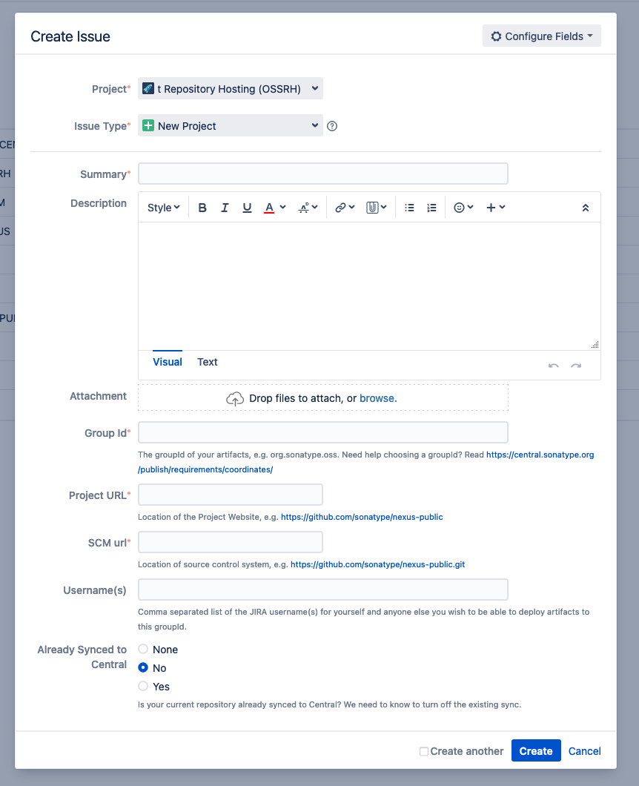

# Artifakte ins Maven Central releasen mit Maven

## Allgemeine Vorbereitung

Unabhängig vom Projekt, müssen folgende Voraussetzungen geschaffen werden, damit die Entwicklerin überhaupt Software-Artifakteins Maven Central releasen kann.

Die erste Voraussetzung ist ein Benutzerkonto im [Sonatype Jira](https://issues.sonatype.org).
Dieses Konto wird einmal gebraucht, um später eine GroupId für das zu releasende Projekt zu beantragen und um sich im [Nexus Repository Manager](https://s01.oss.sonatype.org/) anmelden zu können, um die releaseten Artifakte späte im Maven Central zu veröffentlichen zu können.

Die zweite Voraussetzung ist, dass die Entwicklerin einen PGP-Schlüssel besitzt, mit dem sie die Software-Artifakte signieren kann.
Der öffentliche Teil des PGP-Schlüssels muss auf einem öffentlichen Key-Server verteilt werden, damit Maven Central in der Lage ist die signierten Software-Artifakte bei Hochladen zu verifizieren.
In der offiziellen Sonatype Dokumentation wird das [GPG-Setup](https://central.sonatype.org/publish/requirements/gpg/) ausführlich erklärt.

## Projekt vorbereiten

### GroupId beantragen
Erstellt ein neues Ticket im Sonatype Jire im Projekt "Community Support - Open Source Project Repository Hosting (OSSRH)" mit dem Issue Typ "New Project".
Folgende Felder müssen im Ticket ausgefüllt werden:

- Summary: Titel des Ticket
- GroupId: Die zu beantragene GroupId. Die GroupId muss der [Maven Central Konvention](https://central.sonatype.org/publish/requirements/coordinates/) entsprechen.
- Project URL: URL auf die Projekt Webseite (Beipiel: Github Repo Seite)
- SCM URL: URL auf das Projekt SCM
- Username(s): alle Sonatype User, die auch unter dieser GroupId Artifakte in Maven Central veröffentlichen dürfen
- Already Sync to Central: bei komplett neuen Projekten muss *No* ausgewählt werden

### POM Konfiguration

Jedes Software Artifakt, das in Maven Central veröffentlicht wird, muss zusätzlich zum JAR auch eine Source-JAR und eine Javadoc-JAR veröffentlichen.

IN PROGRESS

## Weitere Links

- [Offizielle Sonatype Dokumentation](https://central.sonatype.org/publish/)

https://blog.sonatype.com/dear-bintray-and-jcenter-users-heres-what-you-need-to-know-about-the-central-repository

https://info.michael-simons.eu/2021/02/05/releasing-maven-based-projects-to-maven-central/

https://securityboulevard.com/2021/02/what-publishers-need-to-know-about-migrating-from-jcenter-bintray-to-the-central-repository/
https://docs.github.com/en/actions/guides/publishing-java-packages-with-maven

https://maven.apache.org/guides/mini/guide-naming-conventions.html
